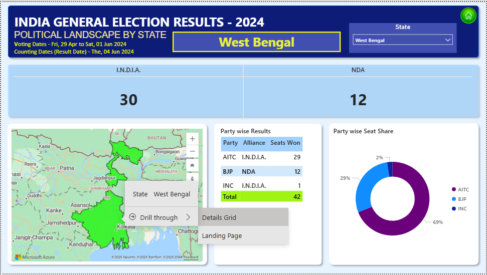

# India_General_Election Results_Analysis_2024
Examining constituency and candidate-level results of the 2024 Indian General Election to uncover key electoral trends and patterns and provide actionable insights using SQL and Power BI.
## Table of Contents
- [Overview](#overview)
- [Problem Statement](#problem-statement)
- [Dataset Details](#dataset-details)
- [Tools & Technologies](#tools--technologies)
- [Project Structure](#project-structure)
- [Data Cleaning & Preparation](#data-cleaning--preparation)
- [Dashboards](#dashboards)
- [Key Insights](#key-insights)
- [Suggestions](#final-recommendations)
- [How to Run This Project](#how-to-run-this-project)
- [Author & Contact](#author--contact)


---

## Overview
This project provides a data-driven analysis of the 2024 Indian General Election Results, transforming a raw dataset into a strategic business intelligence tool. It uses SQL for data preparation, aggregation, and joining multiple tables, and Power BI for interactive visualization. The dashboards enable multi-level analysis of election outcomes, allowing stakeholders to explore results at the national, state, and constituency levels and identify key trends in seat distribution and close contests. The solution demonstrates a replicable framework for turning large-scale electoral data into actionable insights for evidence-based political strategy.

## Problem Statement
During the 2024 Indian General Elections, a large volume of constituency- and candidate-level data was collected. However, the data was scattered, unstructured, and difficult to analyze, making it challenging for political analysts and strategists to quickly extract key insights, such as seat distribution, close contests, and party performance. This is a significant problem because campaigns must use their time, money, and resources efficiently, and confusing data can lead to poor strategic decisions.

To address this, this project uses a publicly available Kaggle dataset (CSV) and implements an end-to-end solution combining SQL and Power BI. The workflow involves data aggregation, and joining of multiple tables in SQL, followed by the creation of interactive dashboards, charts, and maps in Power BI. This approach allows decision-makers to explore election results at national, state, and constituency levels in a clear and intuitive way.

The objective of this project is to demonstrate how a well-designed business intelligence platform can transform complex election data into actionable insights, enabling users to move from data chaos to strategic clarity and make informed, effective decisions.


## Dataset Details
The analysis is based on five core CSV files sourced from Kaggle(CSV), which form the basis of the data model.
- 	Constituencywise Details: Dimension table providing demographic and structural information for each constituency.
- 	Constituencywise Results: The primary fact table containing detailed, candidate-wise vote counts at the constituency level.
-	States: Dimension table containing details of all states and union territories.
-	Partywise Results: Summary table with aggregated election outcomes for each political party.
-	Statewise Results: Summary table with aggregated election outcomes at the state level.


## Tools & Technologies
-	SQL: Used SQL queries with functions like Window functions, CTE’s, Joins, GROUP BY, ORDER BY to analyze election results
-	Power BI: Dashboards, DAX functions, Data Modeling, Drill-through, Bookmarks, Slicer, KPI cards, and Charts
- MS Word: Report Making 

## Project Structure


```bash
India_General_Election_Results_Analysis_2024/
│
├── README.md                                  # Project overview, objectives, and usage
├── .gitignore                                 # Files/folders to ignore in Git
│
├── dataset/                                   # Datasets used for analysis
│   ├── constituencywise_details.csv
│   ├── constituencywise_results.csv
│   ├── partywise_results.csv
│   ├── states.csv
│   └── statewise_results.csv
│
├── scripts/                                   # SQL scripts for analysis
│   ├── KPIs_Queries.sql
│   └── Other_KPIs_Analysis.sql
│
├── dashboard/                                 # Power BI dashboard
│   └── India_General_Election_Result_2024.pbix
│
├── reports/                                   # Reports (Power BI exports & SQL outputs)
│   ├── Indias_General_Election_Result_2024_PowerBI_Report.pdf
│   └── Indias_General_Election_Result_2024_SQL_Report.pdf
│
└── snapshots/                                 # Dashboard screenshots
    ├── 1. Landing_Page.png
    ├── 2. Overall_Analysis.png
    ├── 3. State_Demographics_Analysis.png
    ├── 4. Political_Landscape_by_State.png
    ├── 5. Constituency_Level_Analysis.png
    └── 6. Details_Grid_View.png


```

## Data Cleaning & Preparation
1.  Data Collection: Imported the 2024 Indian General Election dataset from a Kaggle(CSV) files.
2. Data Cleaning: removed blank spaces to ensure data accuracy and consistency.
3. Data Transformation: Aggregated raw data using SQL and Power Query, joined multiple tables to consolidate information, and created new calculated metrics such as Vote Share % and Winning Margin using DAX.
4. Data Modeling: Designed and implemented a Star Schema with a central fact table and multiple dimension tables to create efficient relationships for fast and accurate filtering.

## Dashboards
POWERBI Dashboard Shows:

-  Landing Page: Provides a high-level overview of national election results and key metrics.
- Overall Analysis: Summarizes seat distribution, vote shares, and alliance performance nationally.
- State Demographics Analysis: Highlights state-wise voting patterns, population insights, and demographic trends.
- Political Landscape by State: Visualizes alliance strongholds, seat dominance, and regional competition.
- Constituency-Level Analysis: Details battleground constituencies, turnout, and candidate performance.
- Details Grid View: Offers a tabular, drill-through view of all constituencies with export and filter options.





## Key Insights
1. National Alliance Dominance: NDA led nationally with 292 seats, I.N.D.I.A. secured 234, others 17, showing a coalition-driven mandate.
2. Regional & State Patterns: State-wise analysis highlighted NDA and I.N.D.I.A. strongholds and regional seat dominance.
3. Constituency Dynamics: Detailed data revealed battlegrounds, voter turnout, and competitive margins.
4. Party Contributions Within Alliances: Visualizations showed individual party strengths within alliances.
5. Data Usability: Dashboards enabled seamless navigation from national summaries to constituency-level insights.
6. Strategic Analytics: Insights provided actionable intelligence for planning and understanding regional dominance.

## Suggestions
1. Target Competitive Constituencies: Focus efforts on narrow-margin seats using detailed grid insights.
2. Optimize Resource Allocation: Deploy resources efficiently in high-potential states and consolidate strongholds.
3. Strengthen Regional Alliances: Adjust coalition strategies where alliances underperform.
4. Craft Data-Driven Messaging: Design campaigns based on vote share, turnout, and key issues.
5. Enhance Voter Outreach: Leverage constituency-level data for localized engagement.
6. Utilize Interactive Tools: Use slicers, drill-throughs, and exports to monitor trends and adapt strategies quickly.

## How to Run This Project

1. Clone the Repository:
```bash
git clone https://github.com/Anjaneyak24/India_General_Election_Results_Analysis_2024.git
```
2. Click the links below to open the SQL scripts:
- [KPIs_Queries.sql](scripts/KPIs_Queries.sql)  
- [Other_KPIs_Analysis.sql](scripts/Other_KPIs_Analysis.sql)

3. Click the link below to view the POWERBI Dashboard:
 - [India_General_Election_Results_2024_Dashboard](dashboard/India_General_Election_Results_2024_Dashboard.pbix)

4. Click the links below to view the POWRBI and SQL reports:
- [India_General_Election_Results_2024_PowerBI_Report.pdf](reports/India_General_Election_Results_2024_PowerBI_Report.pdf)  
- [India_General_Election_Results_2024_SQL_Report.pdf](reports/India_General_Election_Results_2024_SQL_Report.pdf)


5. Click the link below to view Datasets:
 - [constituencywise_details](datasets/constituencywise_details.csv)
 - [constituencywise_results](datasets/constituencywise_results.csv)
 - [partwise_results](datasets/partywise_results.csvcsv)
 - [states](datasets/states.csv)
 - [statewise_results](datasets/statewise_results.csv)

## Author & Contact

**Anjaneya K**  
 Data Analyst / Bussiness Analyst  
📧 Email: anjaneyak3.142@gmail.com / anjaneyab3.142@gmail.com
